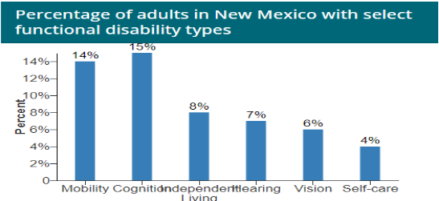
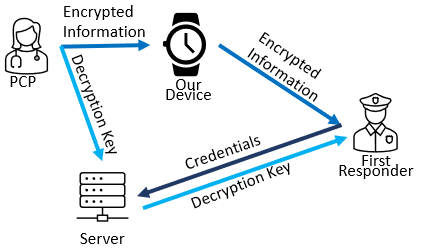

#__TellMe: A Device that tells first responders how to deliver services to people with communication disorders.__
#__New Mexico Connection Academy Stem Team__

_Problem: Now that we live in a post-pandemic world, how can we improve overall mental, physical, or relational health and wellness in our homes, schools, and communities through the use of science, technology, engineering and math (STEM)? Our team discussed a wide variety of issues New Mexicans face today. We determined that mental and physical health issues are a priority that needs to be addressed. We elected to focus on communication disorders as approximately 7.7% of adults 18 and older are reported to have some type of communication disorder. Additionally, Autism spectrum Disorder (ASD) is not included in the classification, although many people who have ASD experience challenges in social interaction and communication. The prevalence of autism in the US is estimated to be approximately 2.5% of the population. The population of individuals in the US that experience significant disabilities and reduced functionality exceeds 66,380,000…_

__Research and background:__ On average, people with developmental disabilities are seven times more likely to come into contact with police officers and first responders than the average person (Enaya, 2023). People with these developmental disabilities and neurodivergence, like autism and encephalitis, can have difficulty communicating with others and responding to outside stimuli. This can be especially detrimental if they are placed into a dangerous situation, because they will not know how to react, and are unable to explain themselves. Police use excessive force against individuals with disabilities and the media often blames the person’s disability over the first responder’s response to the situation. New Mexico has one of the highest rates of police killings per capita (Diaz, 2023). According to an estimate made by the CDC, about 30% of New Mexico’s adult population, or 1 in every 3 adult people, have a disability of some type. The graph for the CDC’s percentage is pictured below [1]. 

The global pandemic revealed the weaknesses of reliable communication in emergency situations. People who have communication disorders have a difficult time communicating in normal times, but especially so during abnormal/emergency circumstances. Often, people with communication disorders have other medical issues that prevent them from effectively communicating such as when they are in a heightened state of emotion, they will become frustrated and become unable to express themselves with words.  An example we faced during the pandemic was trying to help my brother adjust to the changing world that came with it by wearing a mask, communicating with other people wearing masks and  many changed routines. My brother also had trouble communicating on zoom instead of in person because zoom interactions between people were much more individualized and that proved challenging for him. And it was not just my brother who felt this way but many others in the community of neurodivergent thinkers as well. The pandemic really highlighted mental health and the fact that some people have more trouble adapting to changes than others, but more importantly, it showed that a lot of people have trouble expressing their feelings and their mental health issues. This most concerns me when I think back to the police brutality that we witnessed during the pandemic. It is a  concern because my brother, and many people with communication disabilities and mental health disorders, have trouble answering questions and expressing themselves. They could  be subject to the same harsh treatment we saw from the police. We hope that this device could possibly help the police be more aware of what the citizens might be going through and hold off on using aggressive action, as is protocol.

__Current solutions:__ Our society has long neglected the disabled and mentally challenged. It is only now that measures are being taken to ensure safety of those who have long lacked a voice. New Mexico has started a branch of police called the Mobile Crisis Team (MCT), who are trained specifically to work with the mentally disabled and the mentally ill (n.d). In the Federal government, there is also an amendment in place that ensures that:

(. § 35.160 General.
(1) A public entity shall take appropriate steps to ensure that communications with applicants, participants, members of the public, and companions with disabilities are as effective as communications with others (2023).

This allows the use of devices, such as the Vitals App and Life Alert to speak for disabled people in times where they must speak to first responders. This is where the goal for our project originated. The Albuquerque  police department has rules in place dealing with individuals who have behavior and communication disorders. An officer is asked to assess if a person who has behavioral issues is a danger to themselves, the officer, or others. From there, an officer is asked to act according to the level of danger to the situation, and is asked to try and understand the situation before making any rash decisions. However, many officers act with aggression as their first response, so these steps for safety are often rendered moot [2].
__Main Goal:__ To make sure that first responders are aware of communication disorders/needs or mental disorders  that may be exhibited by the person that they are dealing with so the first responders can act accordingly ensuring quick response and support.

__Various Ideas:__
RoboCalm: A robotic companion designed to provide emotional support and assist individuals in managing their mental health.
App Integration: Develop a mobile app that connects with the robot, enabling users to interact with their RoboCalm Companion remotely.
The team felt that this device would be too complicated to create under the time crunch we were experiencing.
Affirmation Teddy Bear and App
A teddy bear who will voice affirmations.
 An app to add any affirmations. We could also include maybe some mental health quizzes. 

The team felt the device was too simple. It was also felt that the idea was not unique enough, one team member citing a  particular Simpsons episode where Grandpa Simpson gets an animatronic seal.

__Selected Approach:__ A vote was cast among members, and the winning project was the TellMe device and app. The team felt this app would be helpful to the New Mexico community and plausible to make in the time we had. Team members were split into two groups. Group one created a design of what they wanted in an app for first responders and the users themselves. Group two designed and created another app and prototype. The TellMe device and app initially were going to have more mechanics and have a wider range for BlueTooth, along with possibly making it waterproof. The plan was to make the device a watch. Ultimately, the device needed to be simplified due to time constraints and limited budget. The Team had thought they would have to decide upon a working device or utilize the programmable watch purchased as time constraints were realized. However, members of the team were able to successfully create a working prototype and app that is more simplified. But the prototype is larger than initially intended, not wearable, and with a smaller bluetooth range than desired by the team.We will present both the watch and the working prototype as with more time this could be accomplished.

__App Design:__

The app: Taylor and Karma used Freehand InVision to create the initial design for both the First Responder version and the User version of the app. Both versions of the app were designed to work with a phone app and would be compatible with the watch. The apps could both be designed and altered to work with other devices including computers, tablets, phones, etc. The User version includes a Create Account page, Login Page, Terms and Conditions Page, Home Page, and Profile Page. The Create Account Page includes info for a new member to start an account with TellMe. This includes the Userto add their first name, last name, email, new password, and confirmed password. The Login Page asks the user to login with their email and password. The Terms and Conditions Page includes the terms for the app. This is always located at the very bottom of the app but it will pop up as a confirmation for a new member to agree to when creating an account. The Profile Page includes the profile picture of the User, the account settings, and guardian control. The account settings include their info they want included for their account. The guardian control includes if the User wants or needs a guardian to overlook the account to input and info needed. 

The First Responder version of the app includes the Login Page, Create Account Page, Profile Page, Terms and Conditions Page, Home Map Page, and Device Connection Page. The Login, Create Account, and Terms and Conditions Page are the same as the Members. The Home Page includes a Map on the screen that shows where the first responder is located at and where the device of the person who needs help is located at. The Map also includes a Key that shows info of the map and what the symbols means. The Device Connection Page includes the connection of the device app connected to the Members device app. The Profile Page is almost the same as the Members profile page, it just does not have the Guardian Control option on there. 

InVision APP DESIGN:

The Physical Prototype:

__Refinements/Changes to design:__ The prototype of the device was simplified from the original version in order to make the device easier for the wearer to use. We removed the touchscreen, and the screen entirely from the wearer because we felt that adding a screen makes the device too easy to manipulate for the wearer. This change renders the above design for ‘user’ inapplicable. The device prototype has an added SD card reader for storing a large amount of files. The prototype group was having difficulty downsizing the device prototype to wrist-watch size. The team started from scratch, learning basics on how a breadboard works, and then expanding outward using internet resources to create the prototype. The Chavez-Williamson household created the initial prototype that sent out a signal to a BlueTooth connection. Malachi Syfrett expanded on the design, adding an SD card reader to hold large files. The team found the initial thought up name “VitaLink” was already utilized in market so changed the name to “TellMe”.

__Effectiveness and quality of design:__
Right now the sending and receiving of the information is a little slow, and relies on a manual connection to the bluetooth device. Future versions will need a code to connect the bluetooth device automatically (which may require a change from the bluetooth HC-05 module to a BLE module). Our design was mostly chosen for proof of concept. We have successfully shown that a file holding the person’s medical information can be securely transferred from a device to a first responder device, using __triple-layer encryption.__ See Below:
InVision APP DESIGN:

__Budget:__
Materials:
·         (2)- HiLetgo 3pcs Pro Mini Atmega328P 5v/16M for Arduino     	                            	            	$12.45
·         (2)- Battery Packs Lithium Ion Polymer Battery 3.7V     	            	                            $13.99   	          
·         (2)- HiLetgo FT232RL FTDI Mini USB to TTL Serial Converter Adapter     	            	$6.49
·         (2)- ELEGOO 120pcs Multicolored Dupont Wire 40pin Male to Female 40pin      	            	$6.98
·         (2)- Nano V3.0 Nano Board ATmega 328P 5V 16M Micro-Controller Board                         	$19.99
·         (2)- San Disk 64GB Extreme Pro SDXC UHS-I                                                                      $14.49      
·         (2)- Chanzon Tactile Tact Push Button Switch 6X6X5mm Micro Momentary Tact              	$6.99
·         (2)- HiLetgo 5 pcs Micro SD TF Card Adapter Reader Module 6Pin SPI Interface               	$6.99
·         (2)- DSD Tech HC-05 Bluetooth Serial Pass through Module Wireless Serial                        	$9.99
·         (1)- 4PCS Breadboards Kit Include 2PCS 830 Point 2PCS 400 Point Solderless                     	$9.98
·                       (2)- DigiKey- TOUCH SCREEN RESISTIVE 3.2"                                                        $5.95
·         (1)- Adafruit- Bangle.js v2-Hackable Javascript Smart Watch                                                   $89.95
										Total $ 204.24

__Safety and Protocol:__ During the building process all team members were in a safe environment and utilized proper safety precautions. On the other hand, to properly implement this device and application into an emergency situation there will need to be many steps initiated for training as had been shown in an interview with a Bernalillo County Sheriff (see below).

__Troubleshooting and Testing:__

The device initially created by Carley Carmen and Danny Chavez-Williamson household has Bluetooth, but was unable to be tested due to the app not being created. The device also did not have the SD card reader connected. Malachi Syfrett continued the creation of the device in his household and was able to connect the device to bluetooth and connect the SD card reader.

__Programming overview:__

The project was split into three main parts for the design: the Primary Care Provider App, The First Responder App, and the Prototype program or Watch. 

The Primary care provider’s app is simple, allowing for the medical information to be written to a file and encrypted before being stored on the user’s device. The encryption key and nonce (used for the salsa20 layer of encryption) will be sent to a server where they will be encrypted by the server and only accessible by proper user authentication. 
 
The first responder app is the next part. When it is not in range of a device, it has a usable purpose as a google search engine. When it detects a device, it reads the encrypted file from the device and, applying proper user authentication, gets the encryption keys from the server so that the file can be decrypted. The file is then read into a program that allows it to be displayed in an easily readable way for the first responder. The full process is described in the graphic below.
InVision APP DESIGN:

The prototype codes itself serves only to differentiate between the PCP app and the First Responder app so it knows whether to send or receive the file. It relies solely on Bluetooth to send and receive files, given that WiFi allows for the possibility of mass hacking, if the server information got leaked. Currently the server is represented solely by a file, due to budget restraints.

__Effectiveness and quality of design:__
Our design works as an effective proof of concept, but would not fare well in the real world. It would need to be heavily scaled down into a watch-sized device, and the bluetooth would need a larger range, which can likely be achieved using Bluetooth Low Energy, found in many devices. This will also allow a smoother connection to the first responder, which is currently not feasible due to a lack of code that connects them. However, the code itself is secure and functional, allowing the encrypted medical information to be moved around easily.

__Future Improvements:__
Since this is only the prototype for the device we plan on creating there were many features that were not included. Here are some of the following features that would have been included: 

A functioning clock built into the device
The ability to be worn on someone's neck, wrist or arm.
The prototype team had discussed adding a heart rate monitor to the device. 
It was also discussed for the device to possibly have a speaker feature.

__Strengths and Weaknesses:__
Strengths: Could inform first responders about any disabilities  the person they are   dealing with might exhibit so the first responders can act accordingly. Another strength is storage space. Weaknesses:  In the instance of our prototype the range for the bluetooth is at an unideal range of 10 meters. The desired goal is 500 meters.  The size of the prototype is also far too large to be worn on somebody's wrist or neck like it was planned to, but the watch is able to suffice.

__Collaboration:__ Carley Carmen Chavez-Williamson: Prototype engineer/ designer
		  Daniel Chavez-Williamson: Prototype engineer/ designer
  Karma Bromwell: Interviewed first responders/ App, Logo, and Designer Engineer
		  Malachi Syfrett: Prototype engineer/ programmer/ app creator
		  Taylor Sipes : App, Logo and Designer Engineer
		  Tristin McNally:Prototype Engineer, Researcher

__Contributions:__
The prototype team were able to create a physical prototype of the TellMe device that was able to successfully read the computer code and broadcast it onto the phone screen.
__Richard Denton former Alamogordo Police Chief__
Richard compared the idea to a notes system currently in place, but noted the heavy human error that occurs with this system. This gave us the idea to restrict the information to only be updated by medical professionals to limit false information occurring throughout the use of this device.
__David from Bernalillo Sheriff’s Department:__
David had expressed that this type of device would be very helpful. He said that while it would be very helpful it would take a lot of extra training. He finished up the interview by saying “If you can find a way to make the training simple and not very  hard to understand then, this would be a very helpful piece of technology.”
__Dr. Thomas Williamson PhD; Paleontology:__
Dr Thomas Williamson proposed removing the touch screen that was originally envisioned for the prototype for he thought that it would over complicate the project. Dr. Williamson also directed the team to switch from using the arduino mini to using the arduino nano since it had a built- in USB port.
Mary Hartley SLP; Speech and Language Pathologist: Ms. Hartley encouraged the creation of the app. She felt that the app would be a “lifesaving device,” that would change the lives of many. Ms. Hartley influenced the design, feeling that a device with a screen may be too easy to toggle for wearers. She also suggested that the device have a strap that would be difficult to remove for wearers. Ms. Hartley felt it was important that the device be secure on the wearer and be difficult to change the settings.

__Bibliography:__

(2023, December 20). Code of Federal Regulations: Subpart E-Communications. National Archives. Retrieved January 8, 2024, from https://www.ecfr.gov/current/title-28/chapter-I/part-35/subpart-E 

Albuquerque Police Department uses the following procedures to Assess and Respond to Individuals Experiencing a Behavorial Health Crisis:    emergency situations, the individual’s behavioral health provider, if known. (2-19 Response to Behavioral Health Issues.pdf
https://documents.cabq.gov/police/standard-operating-procedures/2-19-response-to-behavioral-health-issues.pdf).

[1] Center for Disease Control and Prevention (2023, May 12). Disability & Health U.S. State Profile Data for New Mexico (Adults 18+ years of age). CDC. Retrieved January 7, 2024, from https://www.cdc.gov/ncbddd/disabilityandhealth/impacts/new-mexico.html

[2] City of Albuquerque (n.d.). Albuquerque Community Safety. One Albuquerque. Retrieved January 8, 2024, from https://www.cabq.gov/acs/our-response 

Diaz, J. (2023, April 14). NPR. Retrieved January 6, 2024, from https://www.npr.org/2023/04/14/1169480686/police-killings-new-mexico-gun-ownership 

Enaya, H. (2023, July 17). SAFE Program: Bridging the gap between first responders and citizens with disabilities. Air Force Special Operations Command. Retrieved January 5, 2024, from https://www.afsoc.af.mil/News/Article-Display/Article/3463334/safe-program-bridging-the-gap-between-first-responders-and-citizens-with-disabi/#:~:text=The%20program%20aims%20to%20enhance,well%2Dbeing%20of%20the%20community.

https://autisticadvocacy.org/wp-content/uploads/2017/11/Autism-and-Safety-Pt-1.pdf

Black, Disabled People at Higher Risk in Police Encounters | TIME 

30 guiding principles.pdf (policeforum.org)

https://www.ecfr.gov/current/title-28/chapter-I/part-35/subpart-E/section-35.160 

https://policebrutalitycenter.org/interacting-with-police-if-you-have-a-disability/

https://www.nmhealth.org/publication/view/training/2204/ 

https://cdn.mdedge.com/files/s3fs-public/issues/articles/jhm01603185.pdf

https://usafacts.org/visualizations/coronavirus-covid-19-spread-map/state/new-mexico/

2-19 Response to Behavioral Health Issues.pdf
https://documents.cabq.gov/police/standard-operating-procedures/2-19-response-to-behavioral-health-issues.pdf
  

