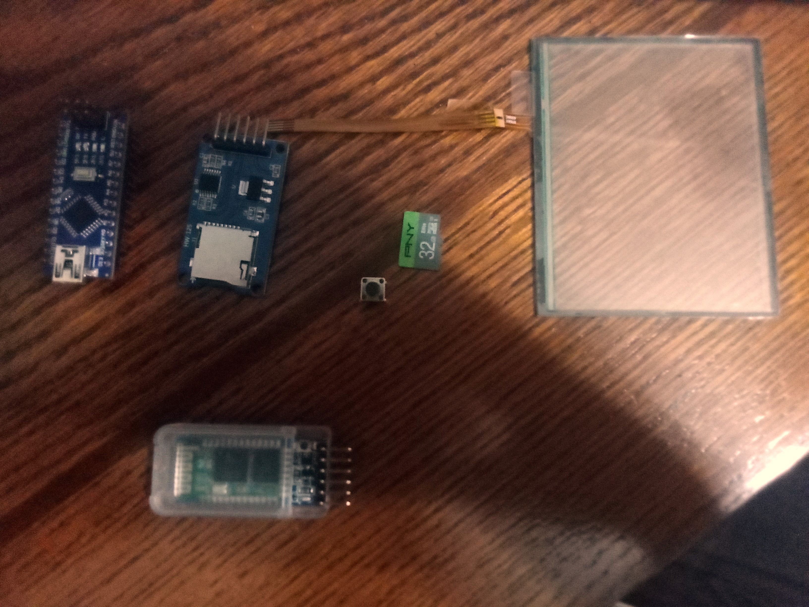

# VitalLink: CRITICAL INFORMATION FOR FIRST RESPONDERS
This repository holds the Code and information for the Governor's STEM Challenge in 2023.

## THE CHALLENGE:
>> Now that we live in a post-pandemic world, how can we improve overall mental, physical, or relational health and wellness in our homes, schools, and communities through the use of science, technology, engineering and math (STEM)?

## THE ORIGIN OF THE IDEA:
The pandemic made us very aware of the mental health and general of those around the world. However, everyone is different, and there was no system that could help first responders to know what situation they are walking into. People with autism, who interacted with Police Officers often found it hard to comply, and the officers, sadly, had to turn to strong force to take control of the situation. Yet if they knew before hand, the officers would have had a very different approach.

Then we realized this would apply to so much more than just autism. People with Allergies, Disabilties, Epilepsy, and Cardiovascular Disease and can be used by more than just Police, but also any first responder. If a paitient comes into the ER while unconcious, the Nurses and Doctors will likely have no clue who they are dealing with, and if the person is allergic to a medication, or is on blood-thinners, or any number of other things, it could potentially harm the paitient.

## THE ORIGIN OF THE DESIGN
So, with this in mind, we began brainstorming. Our first idea was a sticker on clothes or a lanyard that had a bar-code or QR code that could be scanned by a first responder. However we realized this idea would not work very well if the person didn't like how it looked (a very good posibility) and decided to take it off.

So, back to the drawing board, we decided to do something more technologically advanced and came up with the idea of a watch. It could send a bluetooth signal (bluetooth for security, as Wi-Fi makes it hackable on a mass scale) to a first responder's device that would display all the information that they needed.

## THE DESIGN PROCCESS
We began with simple Arduino ATmega328 Board, but after some complications, we moved to the Arduino Nano. The materials we used for the prototype were:
| ITEM | EST. PRICE | Link |
|------|------------|------|
| Aurdino Nano (3ct) | $19.99 | [AMAZON][1] | 
| Pin adapters (120ct) | $9.99 | [AMAZON][2] |
| Buttons (150ct) | $6.99 | [AMAZON][3] |
| SD Card | $9.87 | [AMAZON][4] |
| SD Card Reader (5ct)| $6.99 | [AMAZON][5] |
| Bluetooth Module | $9.99 | [AMAZON][6] |
| Screen | | [{PLACE}][7] |
| TOTAL: | $ |

[1]: https://www.amazon.com/LAFVIN-Board-ATmega328P-Micro-Controller-Arduino/dp/B07G99NNXL/ref=sr_1_2_sspa?keywords=nano+arduino&qid=1703178922&sr=8-2-spons&sp_csd=d2lkZ2V0TmFtZT1zcF9hdGY&psc=1

[2]: https://www.amazon.com/Elegoo-EL-CP-004-Multicolored-Breadboard-arduino/dp/B01EV70C78/ref=pd_bxgy_img_sccl_1/139-7626352-6596345?pd_rd_w=XUVed&content-id=amzn1.sym.7746dde5-5539-43d2-b75f-28935d70f100&pf_rd_p=7746dde5-5539-43d2-b75f-28935d70f100&pf_rd_r=RVH5JCW14DHTQ0FQBXV5&pd_rd_wg=Y8lHF&pd_rd_r=c09821bd-5907-4b85-8b2b-9487bfbfe712&pd_rd_i=B01EV70C78&th=1

[3]: https://www.amazon.com/dp/B09R47N37H/?coliid=I7GZG04WEFU60&colid=36A6QZKXD89C5&ref_=list_c_wl_lv_ov_lig_dp_it&th=1

[4]: https://www.amazon.com/dp/B07R8GVGN9/ref=twister_B0BSYDVHBC?_encoding=UTF8&th=1

[5]: https://www.amazon.com/dp/B07BJ2P6X6/?coliid=I17IYYXTB1CBL1&colid=36A6QZKXD89C5&psc=1&ref_=list_c_wl_lv_ov_lig_dp_it

[6]: https://www.amazon.com/Elegoo-EL-CP-004-Multicolored-Breadboard-arduino/dp/B01EV70C78/ref=pd_bxgy_img_sccl_1/139-7626352-6596345?pd_rd_w=XUVed&content-id=amzn1.sym.7746dde5-5539-43d2-b75f-28935d70f100&pf_rd_p=7746dde5-5539-43d2-b75f-28935d70f100&pf_rd_r=RVH5JCW14DHTQ0FQBXV5&pd_rd_wg=Y8lHF&pd_rd_r=c09821bd-5907-4b85-8b2b-9487bfbfe712&pd_rd_i=B01EV70C78&th=1
